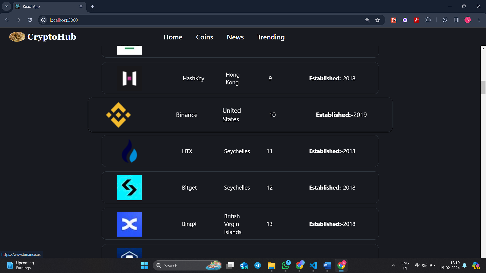
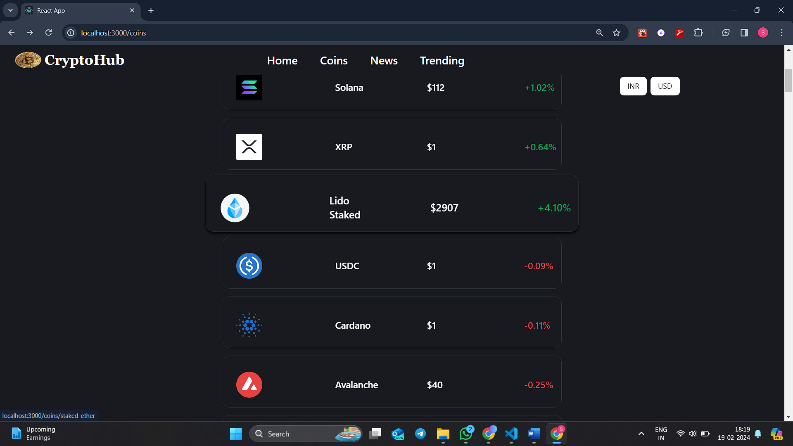
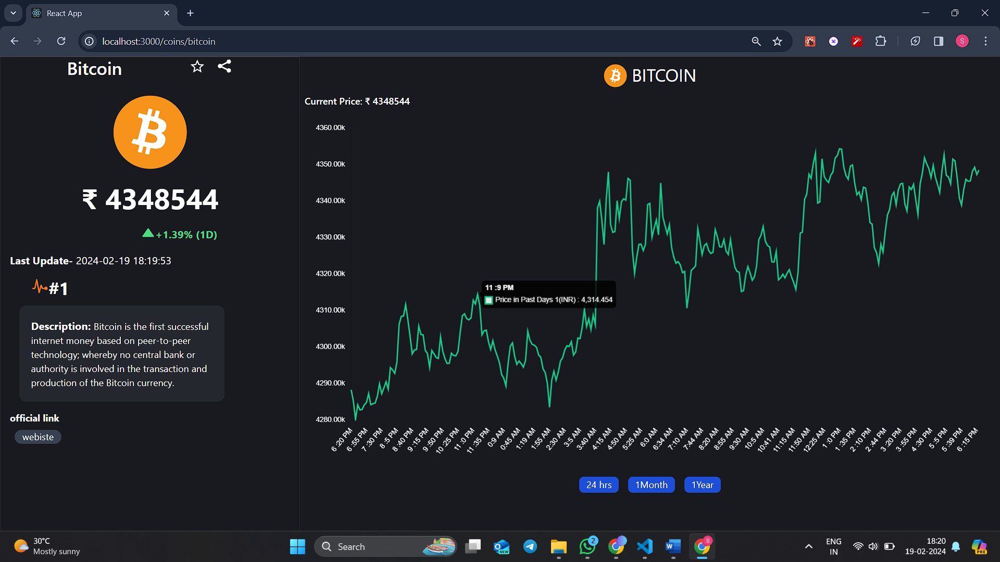
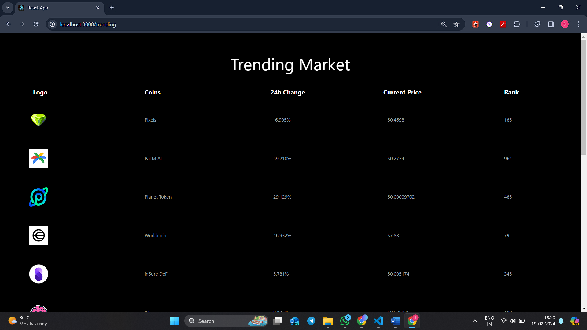

# Cryptocurrency Web App

Welcome to the Cryptocurrency Web App! This web application allows users to explore various exchanges, view a list of available coins, and analyze their price trends through interactive charts.

## Features
1. Exchange Information
Exchange Information:Get up-to-date information on various cryptocurrency exchanges.

  <div align="center" >
  
    <hr/>
</div>
2. Coin Listings
- Coin Listings: Explore a comprehensive list of available coins in the market.
 
 <div align="center">
  
   
</div>
 <hr/>
3. Interactive Charts
- Interactive Charts: Analyze historical price trends using interactive charts.
<br/>
 <div align="center">
  
</div>
 <hr/>
 4. Trending Market
Discover the latest trends in the cryptocurrency market. Our platform provides insights into trending coins, market sentiment, and notable price movements.
<br/>
 <div align="center">
  
</div>
 <hr/>
## Getting Started

### Prerequisites

- Node.js installed
- npm (Node Package Manager) installed

### Installation

1. Clone the repository:

   ```bash
   git clone https://github.com/shrikantg199/CryptoHub.git
